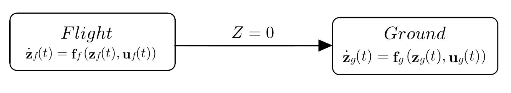
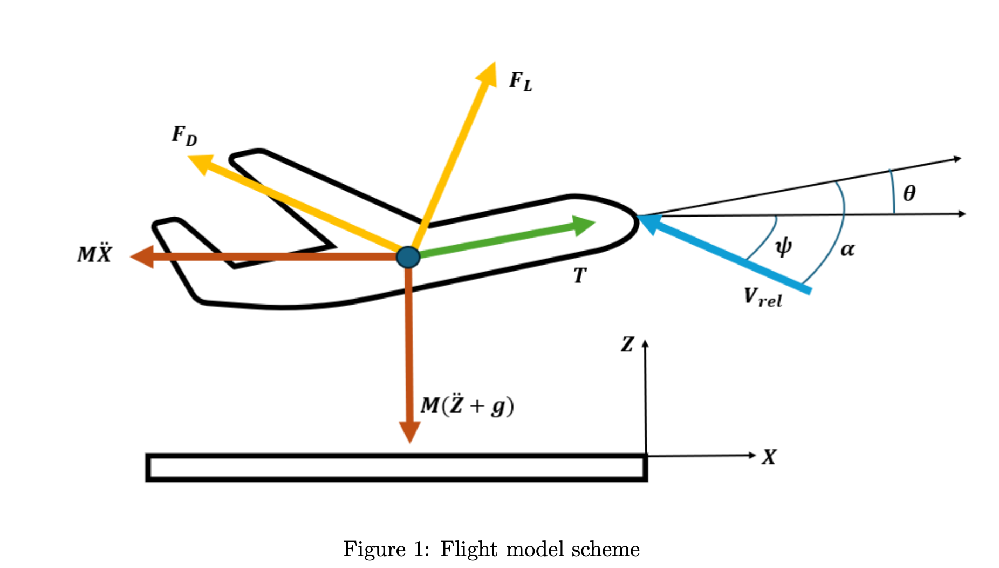
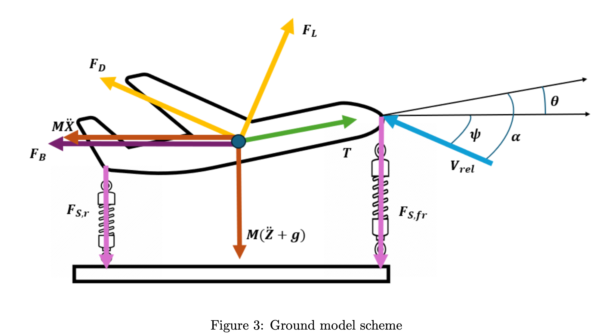

# Aircraft Landing Optimization

## Overview

This project focuses on optimizing the landing procedure of an aircraft to enhance passenger comfort and safety. The primary goal is to minimize the accelerations experienced by the passengers during the final approach and touchdown, which are the most critical phases of a flight. By developing two different dynamical models and applying non-linear numerical optimization techniques, we aim to find optimal control inputs that result in a smooth, comfortable, and efficient landing. A more detailed technical documentation is available in t `report.pdf`.

## Modeling and Simulation

The aircraft's dynamics change drastically between being airborne and being on the runway. To accurately capture this behavior, a hybrid modeling approach was adopted, switching between two distinct models: a **Flight Model** and a **Ground Model**.

### Flight Model

This model describes the aircraft's motion as a rigid body in a 2D plane, subject to aerodynamic, gravitational, and propulsion forces. It governs the dynamics until the moment of touchdown.

**Control Inputs for the Flight Model (`u_f`):**
*   **Thrust (`T`):** Engine propulsion force.
*   **Input Lift Coefficient (`u_L`):** Controls the lift force (`F_L`) generated by the wings.
*   **Input Drag Coefficient (`u_D`):** Controls the drag force (`F_D`), modeling effects like air-brakes.
*   **Pitch Angle Reference (`θ_in`):** The reference command for the aircraft's pitch control system.

### Ground Model

Once the wheels make contact with the runway, this model takes over. It includes the same forces as the flight model but adds crucial new interactions: forces from the landing gear suspension and wheel brakes. This model is essential for simulating the impact absorption and the deceleration phase on the ground.

**Control Inputs for the Ground Model (`u_g`):**
*   **Thrust (`T`):** Typically reduced to zero shortly after touchdown.
*   **Input Lift & Drag Coefficients (`u_L`, `u_D`):** Aerodynamic controls.
*   **Braking Force (`F_B`):** Force applied by the wheel brakes for deceleration.
*   **Front & Rear Active Suspension Forces (`F_Afr`, `F_Ar`):** Forces generated by the active suspension system in the landing gear to dampen vibrations and soften the impact.

### Simulation Engine

The system's differential equations are solved numerically. The fixed-step **Runge-Kutta-2 (RK2)** method was chosen for the simulation due to its computational efficiency. The accuracy of RK2 was validated by comparing its results against the variable-step `ode45` solver from MATLAB, with both methods yielding nearly identical trajectories and acceleration profiles.

## Optimization

To find the optimal control inputs that minimize landing accelerations, we formulated a **Finite Horizon Optimal Control Problem (FHOCP)**. The objective is to find the sequence of control inputs over the entire landing phase that minimizes a cost function based on longitudinal, vertical, and pitch accelerations, while satisfying physical and operational constraints. To solve this non-linear, constrained optimization problem, we used Sequential Quadratic Programming (SQP) through `myfmincon.m` function. This is a function provided by Prof. Lorenzo Fagiano, anyway, `fmincon.m` from MATLAB Optimization Toolbox can also be used. 

### Key Optimization Challenges

The optimization process presented several distinct challenges:

1.  **Sub-Optimality from Model Switching:** Optimizing the flight and ground phases separately can lead to a sub-optimal or unfeasible overall trajectory. To address this, we first solved the ground optimization problem to find the ideal touchdown state (position, velocity, pitch angle). This ideal state then became the target reference for the flight optimization problem, ensuring a smooth and optimal transition between the two models.

2.  **Trajectory Conjunction:** Ensuring a physically realistic match between the end of the flight phase and the start of the ground phase is difficult. For instance, an aircraft needs a positive pitch angle (a "flare" maneuver) for a soft landing, which must be seamlessly matched to the initial state on the ground. This was managed by carefully tuning the constraints on the initial ground state.

3.  **High Computational Load:** The large number of optimization variables (control inputs at each time step) makes the problem computationally expensive. To make the problem tractable, the control inputs were down-sampled, meaning they are held constant over several simulation time steps. This significantly reduces the number of variables for the solver to handle while maintaining effective control.

## Repository Structure 

The repository  is divided into three sub-folders:
- `Simulation`
- `Unconstrained`
- `Constrained`

---
### `Simulation`
---

This folder contains the scripts to perform an analysis of how the switching model for the landing procedure behaves.

To use it, simply open the script named `fly_ground_simulation.m` in MATLAB and run it.

---
### `Unconstrained`
---

The scripts in this sub-folder produce the results for the unconstrained version of the optimization problem.

To use it, simply run the script named `Full_unc_main.m`.

---
### `Constrained`
---

This sub-folder contains the scripts that produce the final results derived from the constrained optimization problem.

To run the complete simulation, just open the script named `final_main.m` in MATLAB and run it.

You may also want to run separate simulations for the ground phase and the flight phase. This is possible by running the scripts `new_main_gr.m` and `new_main_fl.m`, respectively.
